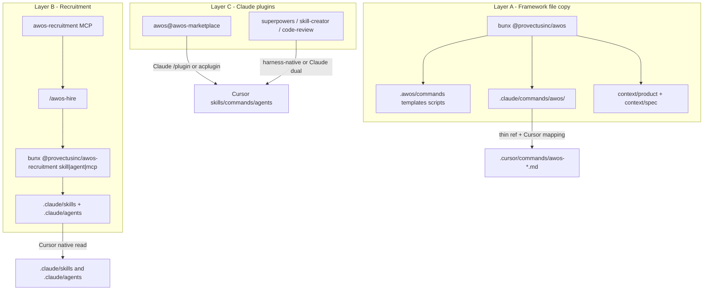

# AWOS on Cursor (and Claude)

Maintainer guide for running [provectus/awos](https://github.com/provectus/awos) in this repo from **Cursor Agent** as well as Claude Code. Product runtime for end users is unchanged — this is contributor / maintainer agent workflow only ([#114](https://github.com/AlexanderMakarov/llm-wiki/issues/114)).

## Installer ≠ plugin

`bunx @provectusinc/awos` (or `npx @provectusinc/awos`) does **not** install the `awos` Claude plugin. The installer:

1. Inits the working tree
2. Creates `.awos/`, `context/`, …
3. Runs migrations
4. Copies `.awos/commands|templates|scripts` and thin `.claude/commands/awos/` wrappers
5. Adds `awos-recruitment` to project `.mcp.json`
6. Registers `awos-marketplace` → `provectus/awos` under `extraKnownMarketplaces` in `.claude/settings.json`

Enabling the optional plugin is a **separate** Claude Code step:

```text
/plugin install awos@awos-marketplace
```

That plugin ships audit + delivery-flow extras (`/awos:ai-readiness-audit`, `/awos:flow`), not the core `/awos:product|spec|tech|tasks|implement|verify` loop (those come from the file copy).

**Prefer `bunx` in this repo.** Fall back to `npx` only when bun is unavailable.

## Three layers



### Slash names differ by harness

| Claude Code | Cursor Agent |
|---|---|
| `/awos:product` | `/awos-product` |
| `/awos:hire` | `/awos-hire` |
| `/awos:flow` (plugin) | `/awos-flow` (after Layer C sync) |
| `/awos:spec` … | `/awos-spec` … |

Cursor has **no** `/awos:` namespace. Project commands are the basename of a **top-level** file under `.cursor/commands/` (e.g. `awos-product.md` → `/awos-product`). Nested `.cursor/commands/awos/*.md` works in some IDE builds but **not** in Cursor Agent CLI — keep wrappers flat. **Always prefix** converted plugin commands with `awos-` (or another source prefix) so slash names show where they came from — raw acplugin leaves `flow.md` → `/flow`, which is easy to miss and collide with.

### What is committed vs local

| Path | Commit? | Why |
|---|---|---|
| `.awos/` | **yes** | Shared Layer A prompts/templates/scripts for the team |
| `.claude/commands/awos/` | **yes** | Claude thin wrappers (installer preserve-on-update) |
| `.cursor/commands/awos-*.md` | **yes** | Flat Cursor wrappers + Layer C commands (e.g. `awos-flow.md`) |
| `.cursor/skills/awos-*/` | **yes** (optional) | Prefixed plugin skills; regenerate with `--plugin` if omitted from git |
| `.cursor/agents/awos-*.md` | **yes** (optional) | Prefixed plugin agents |
| `.cursor/rules/awos-cursor-runtime.mdc` | **yes** | Always-on Claude→Cursor tool map |
| `.mcp.json` | **yes** | Claude Code recruitment MCP entry |
| `.cursor/mcp.json` | **yes** | Cursor project MCP (Cursor does not load root `.mcp.json`) |
| `.claude/settings.json` | **yes** | Marketplace registration only |
| `context/` | **yes** | AWOS product/spec working docs (`product-definition.md`, roadmap, specs, …) — team source of truth for the loop |
| Repo-root `commands/` `skills/` `agents/` `.cursor-plugin/` | **no** | Transient acplugin dumps — gitignored; relocated by sync script |

## Layer A — framework file copy

### First install / update

```bash
./scripts/update-awos.sh              # Layer A only
./scripts/update-awos.sh --plugin     # Layer A + Layer C (marketplace plugin → prefixed .cursor/)
./scripts/update-awos.sh --plugin-only
# or:
#   bunx @provectusinc/awos && ./scripts/sync-awos-cursor-commands.sh
#   ./scripts/sync-awos-plugin-cursor.sh
```

- Source of truth for prompts: `.awos/commands/*.md` (always overwritten on update — do not hand-edit).
- Claude wrappers: `.claude/commands/awos/*.md` — customize here; installer preserves them on update. Slash stays `/awos:product`.
- Cursor Layer A wrappers: **generated** flat `.cursor/commands/awos-*.md` by `scripts/sync-awos-cursor-commands.sh`.
- Cursor Layer C (plugin): **generated** by `scripts/sync-awos-plugin-cursor.sh` — acplugin into a temp dir, then relocate to `.cursor/commands/awos-flow.md`, `.cursor/skills/awos-*/`, `.cursor/agents/awos-*.md` (drops `dist/`). Never leave bare `/flow`.


### Runtime mapping (Cursor)

See [`.cursor/rules/awos-cursor-runtime.mdc`](../../.cursor/rules/awos-cursor-runtime.mdc):

| Claude | Cursor |
|---|---|
| `AskUserQuestion` | Native `AskQuestion` when it is already a first-class tool this turn (invoke by name, same as `Read` / `Shell`). **Never** `CallDynamicTool` with `namespace: cursor` and `toolName: AskQuestion` — the `cursor` namespace is only `CreateGoal`, `GenerateImage`, `UpdateGoal`. If native `AskQuestion` is not injected (Auto / some models), use a numbered list in chat |
| `Agent(subagent_type=…)` | `Task(subagent_type=…)` |
| `general-purpose` | `generalPurpose` |
| Project `.claude/agents/*.md` | Keep kebab-case `subagent_type` |
| `awos-recruitment` tool `search` | Real tool name: `search_capabilities` |
| `/awos:product` | `/awos-product` |

Flat Cursor wrappers repeat that rule so slash-command context does not probe `CallDynamicTool` `cursor`/`AskQuestion` (that call fails with `Tool "AskQuestion" not found in namespace "cursor"`). Native `AskQuestion` is still the structured picker when the host injects it; Cursor's on-demand `cursor` MCP namespace is a different bag of tools and does not include it. Working notes: [`context/spec/011-awos-cursor-askquestion-dispatch/functional-spec.md`](../../context/spec/011-awos-cursor-askquestion-dispatch/functional-spec.md).

## How to install into Cursor

### `awos-recruitment` (MCP — Layer B)

This is an **HTTP MCP server**, not a Cursor `/add-plugin` package. The project already ships the config:

[`/.cursor/mcp.json`](../../.cursor/mcp.json) → `url`: `https://recruitment.awos.provectus.pro/mcp`

1. Open this repo in Cursor (project MCP is loaded from `.cursor/mcp.json`).
2. **Cursor Settings → Tools & MCP** (wording may vary slightly by version).
3. Find **`awos-recruitment`**, enable/approve it if prompted.
4. Reload the window if it does not appear after a fresh clone.
5. Smoke: in Agent, tools for that server should include `search_capabilities` (not `search`).

Claude Code uses the sibling root [`.mcp.json`](../../.mcp.json) instead; if recruitment is disabled there under `disabledMcpjsonServers`, remove that disable entry.

Optional CLI (no MCP UI required for install of hired skills once you know names):

```text
bunx @provectusinc/awos-recruitment skill|agent|mcp <names...>
```

### `awos` plugin (Layer C — audit / flow extras)

The Claude marketplace plugin (`awos@awos-marketplace`) is **not** Cursor-native and is **not** an MCP server (`agent mcp enable awos` will fail — that is expected).

**Claude Code (native):**

```text
# after ./scripts/update-awos.sh (registers awos-marketplace in .claude/settings.json)
/plugin install awos@awos-marketplace
# then /awos:flow , /awos:ai-readiness-audit (skill)
```

**Cursor (harness — preferred):**

```bash
./scripts/update-awos.sh --plugin-only
# or full: ./scripts/update-awos.sh --plugin
```

This runs acplugin, then **prefixes and relocates** into paths Agent actually loads:

| Claude | Cursor path | Slash / skill |
|---|---|---|
| `/awos:flow` | `.cursor/commands/awos-flow.md` | **`/awos-flow`** |
| ai-readiness-audit skill | `.cursor/skills/awos-ai-readiness-audit/` | skill name prefixed |
| repo-auditor agent | `.cursor/agents/awos-repo-auditor.md` | prefixed |

Do **not** stop at a bare `bunx @disdjj/acplugin … --to cursor` in the repo root — that leaves `commands/flow.md` (→ `/flow` if moved raw) outside `.cursor/` so Agent never sees it. If you already dumped to the repo root, `./scripts/sync-awos-plugin-cursor.sh --relocate-only` fixes it.

Reload Agent after sync. Keep the runtime tool-map rule — **acplugin does not rewrite** tool names in bodies.

There is no `/add-plugin awos` for Cursor. Core product→verify loop does **not** require this plugin (Layer A + B are enough).

### Prefix policy for other Claude plugins (skill-creator, etc.)

acplugin always uses the **source filename / skill dirname** with **no marketplace prefix**. After convert you should rename the same way we do for AWOS (`skill-creator-…`, `code-review-…`) before committing under `.cursor/`, or wrap the convert in a small script modeled on `sync-awos-plugin-cursor.sh` (`PREFIX=skill-creator`). Otherwise slash names collide and lose provenance.
## Layer B — recruitment MCP / CLI

### MCP

- Claude Code: root [`.mcp.json`](../../.mcp.json) (`type: http` + URL).
- Cursor: [`.cursor/mcp.json`](../../.cursor/mcp.json) (`url` only — Cursor auto-detects remote transport).

See [How to install into Cursor](#how-to-install-into-cursor) above for the enable steps.

Verified smoke (HTTP): `initialize` returns server `AWOS Recruitment`; `tools/list` exposes `search_capabilities`; a sample `tools/call` with query like `python testing pytest` returns ranked skills (e.g. `pytest-best-practices`).

### CLI hire path

```text
bunx @provectusinc/awos-recruitment skill <name1> [name2 ...]
bunx @provectusinc/awos-recruitment agent <name1> [name2 ...]
bunx @provectusinc/awos-recruitment mcp <name1> [name2 ...]
```

Outputs land in `.claude/skills/`, `.claude/agents/`, and `.mcp.json`. Cursor already reads skills and agents from `.claude/`. Prefer discovering names via MCP `search_capabilities`, then installing with the CLI (or letting `/awos-hire` drive both).

## Layer C — `awos@awos-marketplace` plugin

| Harness | Path |
|---|---|
| Claude Code | `/plugin install awos@awos-marketplace` → `/awos:flow` |
| Cursor | `./scripts/update-awos.sh --plugin` (or `--plugin-only`) → **`/awos-flow`** under `.cursor/commands/` |

## Companion plugins (per harness)

Do **not** assume Claude `/plugin` works inside Cursor.

| Plugin | Claude Code | Cursor |
|---|---|---|
| [Superpowers](https://github.com/obra/superpowers) | `/plugin install superpowers@claude-plugins-official` | First-class: `/add-plugin superpowers` |
| Skill Creator (Anthropic official) | `/plugin install skill-creator@claude-plugins-official` | acplugin + **manual/source prefix** (same idea as `awos-`); or keep Claude for authoring |
| Code Review (Anthropic official `code-review`) | `/plugin install code-review@claude-plugins-official` | Same as skill-creator, or use this repo's review surfaces |

## Update story

```bash
./scripts/update-awos.sh              # Layer A
./scripts/update-awos.sh --plugin     # Layer A + Layer C plugin refresh
./scripts/sync-awos-plugin-cursor.sh  # Layer C only
```

Do **not** rely on a one-off flatten or a raw acplugin dump at the repo root. Layer A: installer never writes `.cursor/`. Layer C: acplugin must be followed by prefix relocate (the sync script).

Details:

1. `bunx @provectusinc/awos` (or `npx`) refreshes `.awos/**`. Claude wrappers under `.claude/commands/awos/` are preserve-on-update.
2. `./scripts/sync-awos-cursor-commands.sh` writes flat Layer A `awos-<name>.md` → `/awos-<name>`.
3. `./scripts/sync-awos-plugin-cursor.sh` runs acplugin and relocates to prefixed `.cursor/commands|skills|agents` (excludes skill `dist/`).
4. Re-run Layer C after AWOS **plugin** version bumps; Layer A after installer package bumps.
## Smoke checklist

- [ ] `./scripts/update-awos.sh` completes without error on a clean or existing tree.
- [ ] Cursor slash **`/awos-flow`** appears after `./scripts/update-awos.sh --plugin` (not `/flow`, not `/awos:flow`).
- [ ] Cursor slash `/awos-product` appears in the `/` menu and loads `.awos/commands/product.md`; when native `AskQuestion` is in the first-class tool list, the agent **calls it by name** (not `CallDynamicTool` `cursor`/`AskQuestion`, not a prose numbered list first). If it is not injected, the agent uses a numbered list in chat. Typing Claude's `/awos:` must not be expected to resolve.
- [ ] `awos-recruitment` appears under Cursor Tools & MCP; `search_capabilities` returns results.
- [ ] `/awos-hire` (or CLI) can install one skill; the skill directory is visible under `.claude/skills/` to Cursor.
- [ ] No personal vault paths or usernames in committed AWOS docs or PR text.
- [ ] After a second `./scripts/update-awos.sh`, wrappers still resolve (sync is idempotent).

## Out of scope (still)

- Changing AWOS upstream to be Cursor-native
- Replacing this repo's wiki slash commands (`/wiki-*`) with AWOS
- Auto-syncing Claude plugin updates into Cursor without a manual refresh
